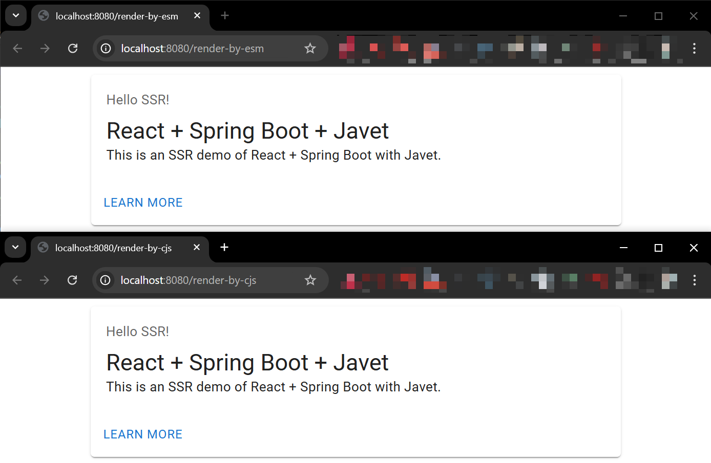

# react-spring-boot-ssr

This project is an SSR demo of React + Spring Boot with Javet.

The complete introduction to this project is in this blog [post](https://blog.caoccao.com/ssr-react-spring-boot-with-javet-536282ff0edb).

## Development

* Install Node.js v22+
* Install Bun v1.1+
* Install pnpm
* Install dependencies

```bash
cd src-react
pnpm install
```

### Run Dev

```bash
cd src-react
pnpm dev
```

### Build

```bash
cd src-react
pnpm build
pnpm build-ssr
```

## Test

* Start the Spring Boot application
* Visit the following URL in your browser
  * [Render by CJS](http://localhost:8080/render-by-cjs)
  * [Render by ESM](http://localhost:8080/render-by-esm)


